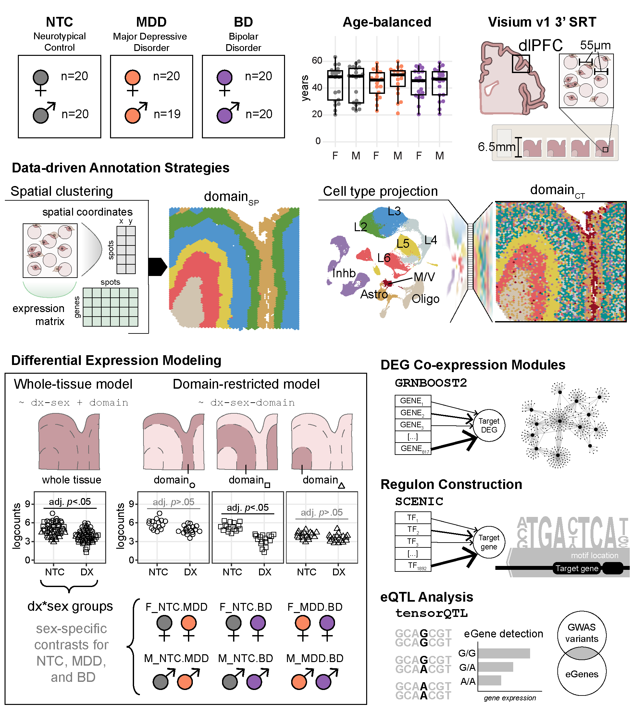

# spatialDLPFC_mdd_bpd

## Goal: [goal statement]

  

## Study Design  

Major depressive disorder (MDD) and bipolar disorder (BD) are common neuropsychiatric conditions with complex etiology and heterogenous presentation, and dysregulated circuit activity in the dorsolateral prefrontal cortex (dlPFC) is linked to both MDD and BPD. The laminar organization of dlPFC circuits was captured in this study using the 10x Genomics Visium platform to generate spatial RNA-sequencing data in postmortem tissue from adult human brain donors (N=119). We investigated sex-specific gene expression changes associated with MDD and BPD in the context of the dlPFC cortical layers to identify converging and unique molecular signatures of each disorder.

## Interactive Websites

All of these interactive websites are powered by open source software,
namely:  

- 🔍 [`samui`](http://dx.doi.org/10.1017/S2633903X2300017X)  
- 👀 [`iSEE`](https://doi.org/10.12688%2Ff1000research.14966.1)  

We provide the following interactive websites, organized by dataset with
software labeled by emojis:  

- Samui (n = 24)
  - 🔍 [DLPFC NTC/MDD/BPD Samui browser  (N=24)](https://samuibrowser.com/from?url=data.libd.org%2Fsamuibrowser%2F&s=MBv_024_MDD_F_Br3893&s=MBv_029_NTC_F_Br8667&s=MBv_030_NTC_M_Br5276&s=MBv_031_BD_F_Br6000&s=MBv_037_MDD_F_Br6114&s=MBv_041_BD_F_Br5753&s=MBv_044_NTC_M_Br6432&s=MBv_045_BD_F_Br5481&s=MBv_047_MDD_F_Br8127&s=MBv_048_MDD_M_Br5673&s=MBv_059_BD_M_Br5477&s=MBv_065_BD_M_Br5440&s=MBv_069_BD_M_Br5437&s=MBv_070_BD_F_Br8134&s=MBv_071_MDD_M_Br3998&s=MBv_072_MDD_F_Br6424&s=MBv_076_MDD_M_Br8404&s=MBv_077_NTC_F_Br1113&s=MBv_078_NTC_M_Br5558&s=MBv_090_BD_M_Br5249&s=MBv_091_NTC_F_Br8492&s=MBv_096_MDD_M_Br6320&s=MBv_097_NTC_M_Br5572&s=MBv_121_NTC_F_Br8100)
- Pseudobulk (n = 119)
  - 👀 [pseudobulked iSEE app](https://interactive.libd.org/pseudobulk_dlPFC_MBv/)

## Data Access
Public [globus endpoint](https://research.libd.org/globus/) to access R objects associate with apps for this project.  
SpaceRanger processed data outputs, can be accessed via Gene Expression Omnibus (GEO) under accessions [GSE333974](https://www.ncbi.nlm.nih.gov/geo/query/acc.cgi?acc=GSE333974). 
Zenodo Archive for this project can be found at [link](link). Project data was also uploaded to the National Institute of Mental Health Data Archive (NDA) and can be found at [10.15154/m7k5-3z24](https://dx.doi.org/10.15154/m7k5-3z24).

## Contact

We value public questions, as they allow other users to learn from the
answers. If you have any questions, please ask them at
[LieberInstitute/spatialDLPFC_mdd_bpd/issues](https://github.com/LieberInstitute/spatialDLPFC_mdd_bpd/issues)
and refrain from emailing us. Thank you again for your interest in our
work!

